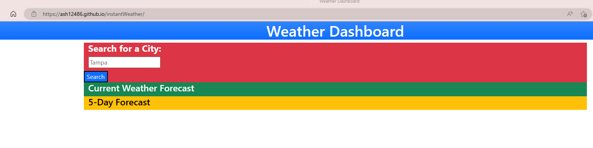
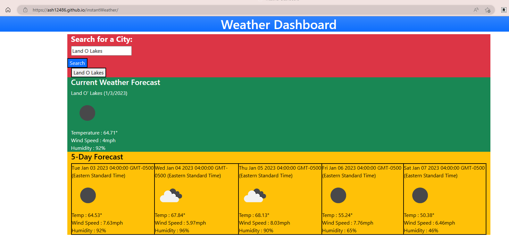
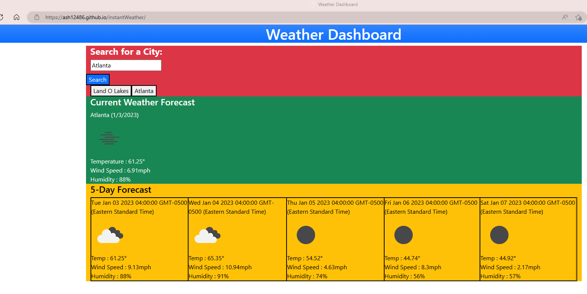

# instantWeather

DESCRIPTION
This is a basic weather website, that shows current weather, and the 5-day forecast. This website holds the search history in localestorage and enables the user to click a button to view prior searched cities.

## USER STORY
AS A traveler
I WANT to see the weather outlook for multiple cities
SO THAT I can plan a trip accordingly

## ACCEPTANCE CRITERA
GIVEN a weather dashboard with form inputs
WHEN I search for a city
THEN I am presented with current and future conditions for that city and that city is added to the search history
WHEN I view current weather conditions for that city
THEN I am presented with the city name, the date, an icon representation of weather conditions, the temperature, the humidity, and the the wind speed
WHEN I view future weather conditions for that city
THEN I am presented with a 5-day forecast that displays the date, an icon representation of weather conditions, the temperature, the wind speed, and the humidity
WHEN I click on a city in the search history
THEN I am again presented with current and future conditions for that city

## SCREENSHOTS
Live URL: https://ash12486.github.io/instantWeather/

## MOCK-UP IMAGE
This is what the result should look like.

## DESIGNER NOTES
- This program uses an API to pull weather data from https://openweathermap.org/api

